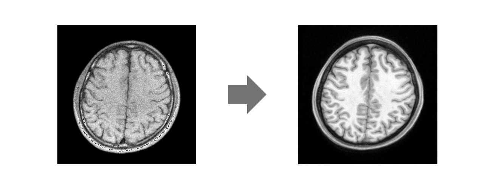
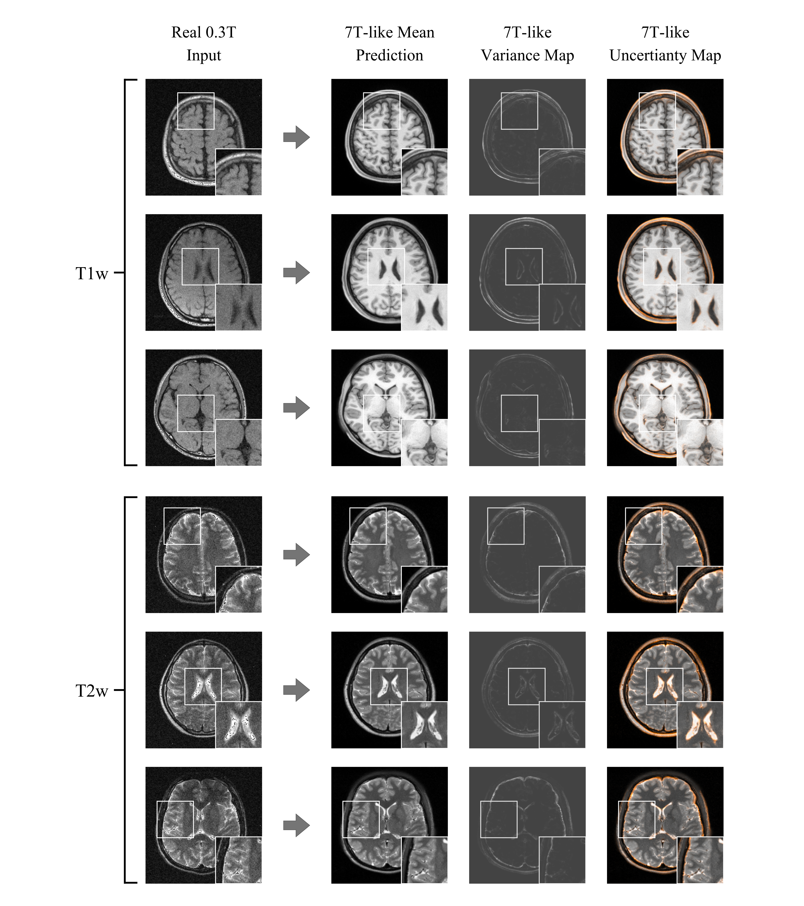

# LF-7T-CycleGAN

A CycleGAN-based approach for enhancing low-field (0.3T) MRI scans to a 7T-like quality.

## 1. Codebase Navigation

This repository contains all of the code required to re-implement LF-7T-CycleGAN.

The purpose of each directory is as follows:

1. `LF-7T-CycleGAN/` includes the code required to train and test the proposed model.
2. `pre-process/` contains the extensible MRI scan pre-processor developed by this project to extract standardised 256x256 MRI slices from raw datasets.
3. `model-evaluation` has all the code required to compare LF-7T-CycleGAN to un-modified CycleGAN and SRDDL.
4. `out-of-distribution-analysis` includes the code to test model performance on data outside of the training distribution.
5. `visualisations` includes a notebook file to generate images with zoomed patches for use in visualisations.

## 2. Setup

System requirements: It is **highly** recommended  that this code is run on a system with a dedicated GPU that can run the latest versions of CUDA. For example, this project was mostly trained on an NVIDIA 3060 Ti. Older systems were tested, however due to the lack of modern CUDA support, operations would frequently default back to the CPU, drastically increasing the time per epoch.

### 2.1. Clone This Repo

Run the following commands to clone the repository

```
git clone https://github.com/Littled2/LF-7T-CycleGAN

cd LF-7T-CycleGAN
```

### 2.2. Install Dependencies

To run this project, Anaconda must first be installed. You can download an installer from [here](https://www.anaconda.com/download).

The required dependencies are listed in `environment.yml`. To create the conda environment, please run:

```
conda env create -f environment.yml
```

Then activate the new environment using:

```
conda activate mri
```

### 2.3. Dataset Setup

This project used 7T MRI data from the [Human Connectome Project](https://www.humanconnectome.org/hcp-protocols-ya-7t-imaging), and 0.3T data from the [M4Raw](https://zenodo.org/records/8056074) dataset. Both datasets can be downloaded for free from their respective websites.

Once downloaded, Please update `config.json` to reflect the file paths on your local system. This file controls the behaviour of the pre-processing pipeline. For information about the slice indices selected for training LF-7T-CycleGAN, please see the appendix of the final report.

Run `python preprocess.py` to generate the dataset in the correct format. This process must be repeated for each contrast.


## 3. Training

Once the dataset is generated, it is time to train. Each ensemble model is trained independently.

To train and test LF-7T-CycleGAN, please navigate to `LF-7T-CycleGAN/` and run the following command (after replacing the parameters in sqiuare brackets):

```
python train.py --dataroot [DATASET PATH] --name [MODEL NAME] --model cycle_gan --netG mri --dataset_mode mri --input_nc 1 --output_nc 1 --no_flip --n_epochs 100 --n_epochs_decay 100  --batch_size [1 or 2 depending on your GPU] --no_html --seed 42 
```

Optionally, you can use WandB to visualise the training process by appending these flags to the training command:
```
--use_wandb --wandb_project_name [WANDB PROJECT NAME]
```

### 3.1. Training an Ensemble

The above process will need to be repeated `n` times, where `n` is the number of models in your ensemble. Ensure that the `--name` argument is changed each time to avoid overwriting previous ensemble members.

## 4. Running Inference

Inference is executed using the `test.py` file in the `LF-7T-CycleGAN/` directory. This file has been adapted to allow inference to be run using an ensemble or a single model.

In addition to `.png` results, if you wish to save enhancements as `.npy` files, add the `--save_npy` flag to any test command.

### 4.1 Testing a Single Model

The following command should be run in the `LF-7T-CycleGAN/` directory:

```
python test.py --dataroot [DATASET PATH] --name [TRAINED MODEL NAME] --model cycle_gan --no_dropout --netG mri --input_nc 1 --output_nc 1 --no_flip --dataset_mode mri --test_name [SPECIFY TEST NAME FOR SAVING]
```

### 4.2 Testing an Ensemble

Before running this command, ensure all ensemble members have been copied to the same directory.

The following command should be run in the `LF-7T-CycleGAN/` directory:

```
python test.py --dataroot [DATASET PATH] --test_name [TRAINED MODEL NAME] --model cycle_gan --no_dropout --netG mri --input_nc 1 --output_nc 1 --no_flip --dataset_mode mri --checkpoints_dir [PATH TO ENSEMBLE MODELS] --ensemble_models [MODEL 1] [MODEL 2] [MODEL 3] etc...
```

## 5. Evaluating Performance

The required code to benchmark the proposed model against super-resolution deep dictionary learning (SRDDL) and an un-modified instance of CycleGAN can be found in the `model-evaluation/` directory.

### 5.1 Training Un-modified CycleGAN

Instructions to run the un-modified CycleGAN model can be found in the [official repository](https://github.com/junyanz/pytorch-cyclegan-and-pix2pix) or in the `model-evaluation/comparison-models/pytorch-cyclegan-and-pix2pix` folder of this project. A custom dataset has been included to permit training using the same `.npy` files as LF-7T-CycleGAN.

The training command for un-modified cycleGAN used in this project follow this syntax:


### 5.2 Training SRDDL

This study chose to fine-tune a pre-trained version of SRDDL to perform 0.3T to 7T translation. The code for fine-tuining and subsequent inference are included in the `model-evaluation/comparison-models/SRDDL/` folder. Instructions are written in the notebook files in this directory.

### 5.3 Quantitative Evaluation

A python notebook file has been provided in the `model-evaluation/quantitative-evaluation/` directory with code cells for calculating the PSNR, SSIM and LPIPS of each trained model.

## 6. Out of Distribution Analysis

The code to perform this analysis and instructions are included in `out-of-distribution-analysis/OOD-analysis.ipynb`.

## 7. Example Results

Some example enhancements from LF-7T-CycleGAN are included below.

